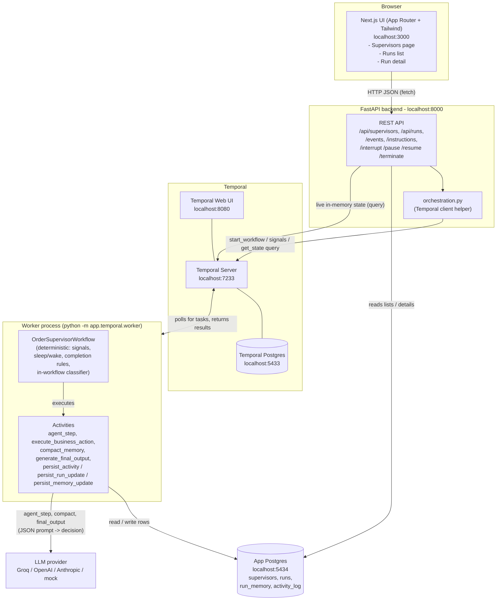
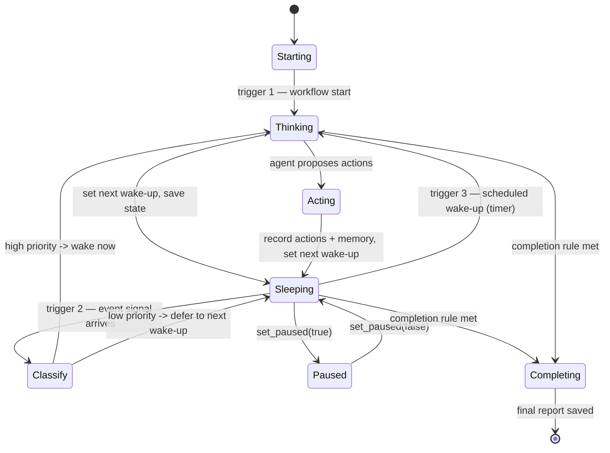
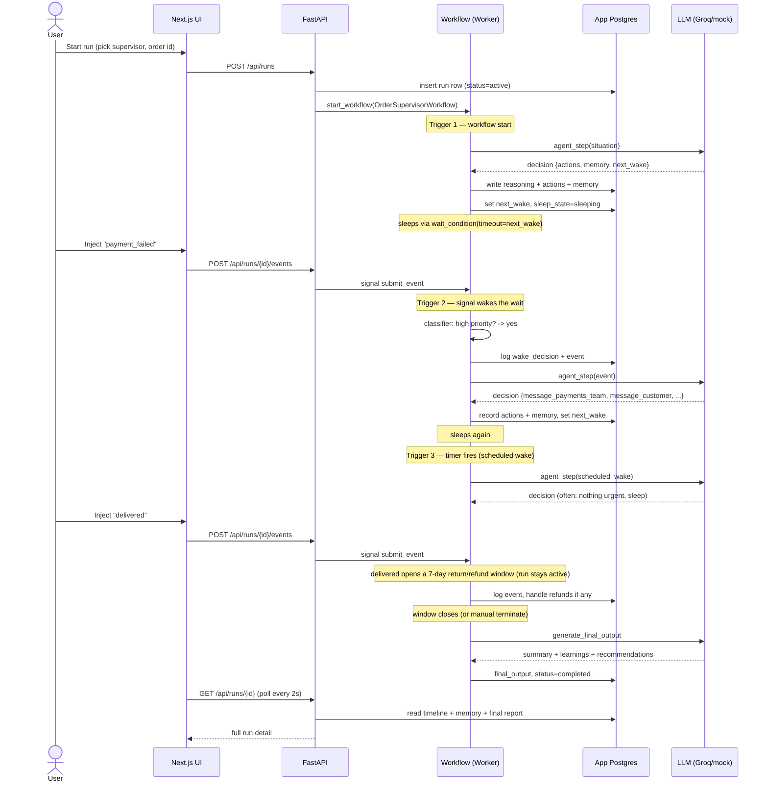
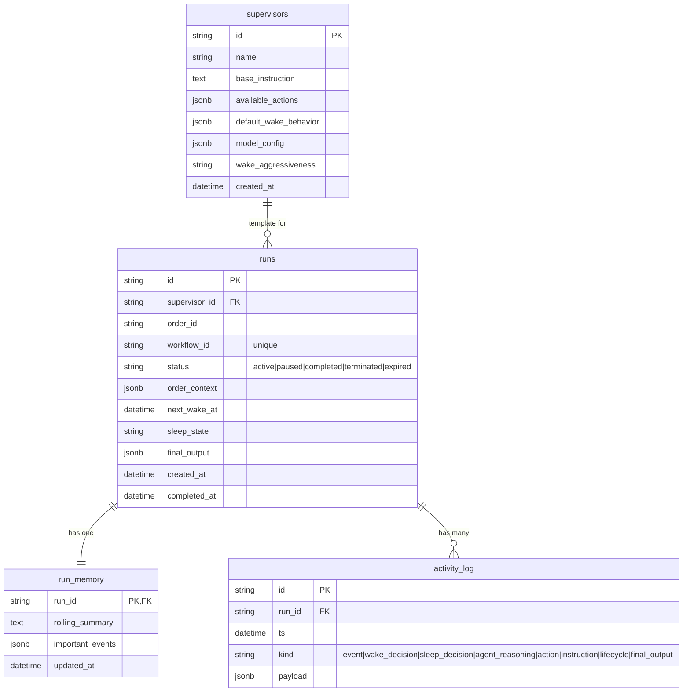

# Order Supervisor

A long-running AI "supervisor" that watches a single e-commerce order from creation to completion, built on Temporal.

---

## 1. What is this project?

This project runs one AI supervisor per order. The supervisor watches what happens to that order over time (payment, shipping, delivery, refunds). It decides when to step in and do something, and when to do nothing and sleep. It is built for engineers who want to see how a long-lived, event-driven AI agent can be modeled cleanly with Temporal, a database, and a small web UI.

It is a proof of concept (POC), not a production system. Nothing is sent to real customers or real teams — every "action" is recorded in a database instead.

## 2. The problem it solves

Imagine you bought headphones online. Over the next few days many things happen: the payment is confirmed, a shipment is created, maybe it gets delayed, you message support, and finally it is delivered. Normally a human (or a pile of rules) keeps an eye on all this.

This project replaces that watcher with an AI supervisor. The hard part is that an order's life is long and mostly quiet. You do not want an AI running in a tight loop 24/7 — that is slow and expensive. So the supervisor **sleeps** most of the time and only **wakes up** when something important happens or when its own alarm goes off. When it wakes, it thinks, maybe takes an action, updates its memory, and goes back to sleep.

## 3. Key features

- One Temporal workflow per order (one independent, long-lived supervisor each).
- Three ways the agent wakes: at workflow **start**, on an important **event/signal**, and on a **scheduled wake-up**.
- A lightweight **classifier** decides if an incoming event is worth waking the AI now or can wait.
- **5 business actions** the agent can take (message teams / customer, write a note) — each recorded in the database.
- **Memory**: a rolling summary plus a list of important events, with automatic compaction so it stays small.
- **Workflow-owned completion**: the AI can *suggest* finishing, but real rules decide when a run ends.
- Realistic lifecycle: **delivery opens a 7-day return/refund window**; an order that is never delivered **expires**, gets escalated to a human, and the customer is auto-refunded.
- A **final report** at the end: summary, key actions, learnings, recommendations.
- A small web UI to configure supervisors, start runs, inject events, add instructions, and pause / resume / interrupt / terminate.
- Pluggable LLM provider (Groq, OpenAI, Anthropic, or a no-key **mock**).

## 4. How it works (the big picture)



Each box, in plain words:

- **Next.js UI** — the website you click on. It only talks to the FastAPI backend.
- **FastAPI backend** — the web server. It handles requests, reads the database for lists and details, and uses a Temporal client helper to start workflows, send signals, and ask the running workflow for its live state.
- **Temporal Server** — the engine that runs long-lived workflows and keeps them safe across restarts. It has its own separate Postgres for internal bookkeeping.
- **Worker process** — a separate Python program. This is where the workflow code and the activities actually run. Temporal hands it work to do.
- **App Postgres** — our application database. Everything the UI shows lives here.
- **LLM provider** — the AI brain. Only certain activities call it.

## 5. A quick word on Temporal

Temporal is a tool for running long-lived processes reliably. A few terms, in one sentence each:

- A **workflow** is a long-running function that can pause for days and survive crashes; Temporal remembers exactly where it was.
- An **activity** is a normal function for side effects (calling the AI, reading or writing the database); workflows call activities to do anything that touches the outside world.
- A **signal** is a message sent into a running workflow from outside (for example, "a new event arrived").
- A **query** reads a running workflow's current in-memory state without changing it.
- A **durable timer** is a sleep that Temporal tracks for you; the workflow can "sleep" for hours or days at almost no cost and wake up exactly on time.

We use Temporal because an order lives a long time, is mostly idle, and must not lose its state if a server restarts. Temporal gives us cheap sleeping, reliable wake-ups, and safe long-running state for free.

> Important rule: workflow code must be **deterministic** (same input always gives the same steps). So we never call the AI, the database, the clock, or the network directly inside the workflow. All of that goes into activities. The workflow uses `workflow.now()` for time.

## 6. The agent's loop: wake, think, act, sleep



The agent runs on exactly **three triggers**, then goes back to sleep:

1. **Workflow start** — the very first run, using the order details and the base instruction.
2. **An incoming event (signal)** — but only if the **classifier** rates it important.
3. **A scheduled wake-up** — the sleep timer runs out with nothing pending.

The **classifier** is a small, fast rulebook inside the workflow (not the AI). For each event it answers one question: "wake the main AI now, or let it keep sleeping?"
- Terminal or unknown events → always wake (unknown events are escalated to be safe).
- Events the AI flagged as important (its "wake guidance") → wake.
- Otherwise it depends on the supervisor's setting: `aggressive` wakes on everything, `balanced` wakes on the high-priority set, `conservative` wakes only on payment/refund failures.
- Low-priority events are logged and the workflow sleeps for the time it had left.

This keeps the expensive AI calls rare and the cheap rule checks frequent.

## 7. An order's journey, end to end



Step by step in plain English:

1. You start a run from the UI. The API creates a run row in the database and starts the workflow.
2. The workflow wakes for the first time (start trigger), asks the AI what to do, records the result, sets an alarm, and sleeps.
3. You inject an event (for example, `payment_failed`). That becomes a signal into the workflow.
4. The classifier checks the event. `payment_failed` is high priority, so it wakes the AI.
5. The AI decides to message the payments team and the customer. The workflow runs those actions (each becomes a database record), updates memory, sets a new alarm, and sleeps.
6. Later the alarm goes off with nothing pending (scheduled wake). The AI looks around, usually decides nothing is urgent, and sleeps again.
7. You inject `delivered`. The run does not end. Instead it opens a 7-day return/refund window and keeps watching (so a late refund is still handled).
8. When the window closes (or you terminate the run), the AI writes the final report. The run is marked `completed` and the UI shows everything.

There is also a safety path: if an order is **never delivered** and reaches its max age, the run **escalates to the fulfillment team, auto-refunds the customer, records it in memory, and ends with status `expired`**.

## 8. The 5 business actions + runtime capabilities

The agent can take **5 business actions**. None of these send anything to the outside world — each one simply writes an `action` record into the database, which the UI then shows.

| Action | Meaning |
|---|---|
| `message_fulfillment_team` | Note a message to the fulfillment/warehouse team |
| `message_payments_team` | Note a message to the payments team |
| `message_logistics_team` | Note a message to the shipping/logistics team |
| `message_customer` | Note a message to the customer |
| `create_internal_note` | Write an internal note |

The agent also has **runtime capabilities**. These are not separate tools — they are fields in the single decision the AI returns, which the workflow then acts on:

- **Sleep / set next wake-up** — the AI returns `next_wake_seconds`; the workflow sets the timer.
- **Update memory** — the AI returns `memory_update` (a new rolling summary) and/or `important_event` (pin to the timeline).
- **Record reasoning** — the AI's `reasoning` text is saved as an `agent_reasoning` record.
- **Wake guidance** — the AI can list event types that should wake it early; the classifier reads this.
- **Recommend completion** — the AI can set `recommend_completion`, but this is only a hint; the workflow decides when to end.

How an action is actually run: the AI proposes actions in JSON, a strict schema validator drops any name that is not one of the 5, and then the workflow executes the survivors through the `execute_business_action` activity. The AI never runs anything itself.

## 9. Memory and timeline

Each run keeps a small, useful memory so the AI is not re-reading its whole history every time:

- **Rolling summary** — one short paragraph describing the situation so far.
- **Important events** — a short list of pinned highlights.
- **Timeline / activity log** — the full ordered history of everything that happened (events, wake/sleep decisions, reasoning, actions, instructions, final report). This is the `activity_log` table and powers the UI timeline.

**Compaction** keeps memory from growing forever. When the important-events list gets too long, the workflow runs the `compact_memory` activity: the AI folds the older entries into the rolling summary, and only the most recent few are kept as separate items. So old detail is summarized, not lost.

## 10. Tech stack

| Layer | Technology |
|---|---|
| Frontend | Next.js (App Router) + Tailwind CSS |
| Backend | Python + FastAPI |
| Orchestration | Temporal Python SDK (`temporalio`) |
| Database | PostgreSQL (via SQLAlchemy async + asyncpg) |
| LLM | Pluggable: Groq / OpenAI / Anthropic / mock (via `httpx`) |
| Infra | Docker Compose (Temporal, Temporal UI, two Postgres) |

## 11. Project structure

```
order-supervisor/
  docker-compose.yml          # Temporal + Temporal UI + 2 Postgres (app + Temporal's own)
  .env.example                # template for backend settings
  README.md                   # this file
  ARCHITECTURE.md             # short architecture note
  backend/
    requirements.txt          # Python dependencies + exact versions
    app/
      main.py                 # FastAPI app; creates tables + seeds templates on startup
      config.py               # reads settings from .env
      constants.py            # the 5 actions, 9 event types, classifier priority map
      db/
        models.py             # SQLAlchemy tables: supervisors, runs, run_memory, activity_log
        session.py            # async database engine + session
        repo.py               # all read/write functions (used by API and activities)
        init_db.py            # create tables + seed 2 supervisor templates
      api/
        supervisors.py        # /api/supervisors routes
        runs.py               # /api/runs routes + events/instructions/controls
        schemas.py            # request body models
      temporal/
        client.py             # connect to Temporal
        worker.py             # registers the workflow + activities; run this process
        workflows.py          # OrderSupervisorWorkflow (the core: signals, sleep/wake, completion)
        activities.py         # agent_step, execute_business_action, compact_memory, final_output, persist_*
        orchestration.py      # helpers the API uses (start, signal, query, terminate)
        types.py              # dataclasses passed into the workflow
      agent/
        llm_client.py         # pluggable LLM client (groq/openai/anthropic/mock)
        prompts.py            # prompts for agent step, compaction, final output
        schemas.py            # strict decision schema + safe fallback parser
    scripts/
      demo.py                 # seeded event generator (drives a full order story)
      check_llm.py            # one live AI call to test your key
      test_workflow.py        # runs the whole workflow in Temporal's time-skipping test env
  frontend/
    package.json              # Next.js + React + Tailwind; run scripts
    app/
      page.tsx                # runs list + start-run form
      supervisors/page.tsx    # supervisor templates list + create form
      runs/[id]/page.tsx      # run detail: timeline, memory, controls, event injector
      layout.tsx, globals.css
    lib/
      api.ts                  # typed client for the backend API
      ui.tsx                  # small UI helpers (status badges, time format)
```

## 12. Data model



- **supervisors** — reusable templates: a name, base instruction, the allowed actions, default wake behavior, optional model config, and how aggressively to wake.
- **runs** — one row per order being supervised: its status, the order details, the next wake time, and the final report (filled in at the end).
- **run_memory** — the rolling summary and the list of important events for a run.
- **activity_log** — one append-only row for everything that happens, tagged with a `kind`. This single table is the timeline.

## 13. The UI

The UI has three screens. It auto-refreshes so you can watch a run live.

**Supervisors page** (`/supervisors`) — create and view supervisor templates.

```
+--------------------------------------------------------------+
|  Order Supervisor              [ Runs ]  [ Supervisors ]      |
+--------------------------------------------------------------+
|  New supervisor template                                     |
|  Name:           [____________________________]              |
|  Base instruction:                                           |
|  [__________________________________________________]        |
|  Wake aggressiveness: ( ) conservative (o) balanced          |
|                       ( ) aggressive                         |
|  Default wake (sim hours): [ 6 ]                             |
|  Available actions: [x] message_fulfillment_team             |
|                     [x] message_payments_team ...            |
|                     [  Create template  ]                    |
+--------------------------------------------------------------+
|  Templates                                                   |
|  - Standard Order Supervisor        [balanced]               |
|  - High-Touch VIP Supervisor        [aggressive]             |
+--------------------------------------------------------------+
```

**Runs list** (`/`) — start a new run and see all runs.

```
+--------------------------------------------------------------+
|  Start an order run                                          |
|  Supervisor: [ Standard Order Supervisor v ]                 |
|  Order ID:   [ ORDER-123 ]   (blank = auto)                  |
|  Order context (JSON): [ {"item":"Headphones","amount":199} ]|
|  Default wake (sim hours): [ 6 ]      [  Start run  ]        |
+--------------------------------------------------------------+
|  Runs                                                        |
|  Order            Status     Sleep      Next wake   Created  |
|  ORDER-123        [active]   sleeping   12:34:56    12:30    |
|  ORDER-DELIV-1    [completed] ended     -           11:05    > open
+--------------------------------------------------------------+
```

**Run detail** (`/runs/[id]`) — watch and control one run.

```
+--------------------------------------------------------------+
|  <- runs                                                     |
|  ORDER-123  [active]  sleep: sleeping  next wake: 12:34       |
|             turn: 4   [agent recommends completion]          |
|  workflow: order-supervisor-abc123                           |
|  (banner) Delivered - return/refund window open until 13:00  |
+--------------------------------------------------------------+
|  [Pause] [Interrupt (act now)] [Terminate] [Hard kill]       |
+----------------------------+---------------------------------+
|  Inject event              |  End-of-run output (when done)  |
|  [order_created]           |  Summary: ...                   |
|  [payment_failed] ...      |  Learnings: ...                 |
|  [delivered] ...           |  Recommendations: ...           |
|                            +---------------------------------+
|  Add run instruction       |  Timeline & activity (18)       |
|  [______________________]  |  [event]  payment_failed (high) |
|  [ Send instruction ]      |  [wake]   important_event       |
|                            |  [reason] (signal) Payment...   |
|  Memory                    |  [action] message_customer ...  |
|  Rolling summary: ...      |  [action] message_payments...   |
|  Important events:         |  [sleep]  until 12:34           |
|   - Order creation         |  ...                            |
|   - Payment failed         |                                 |
+----------------------------+---------------------------------+
```

What each screen lets you do:
- **Supervisors** — create a template and see existing ones.
- **Runs list** — start a run for an order and open any run.
- **Run detail** — inject events, add instructions, pause / resume / interrupt / terminate, and watch the timeline, memory, and final report update live.

## 14. Getting started

### Prerequisites
- Docker Desktop (running) — tested with Docker 29 / Compose v2+
- Python 3.11+
- Node.js 18+ (tested on Node 24)

### Step 1 — Start the infrastructure
From the `order-supervisor/` folder:
```bash
docker compose up -d
```
This starts: Temporal server (`localhost:7233`), Temporal Web UI (`localhost:8080`), the app Postgres (`localhost:5434`), and Temporal's own Postgres (`localhost:5433`). Give Temporal ~20-30 seconds on first boot.

> Note: the app database is published on host port **5434** (not 5432) so it will not clash with a Postgres already installed on your machine.

### Step 2 — Backend settings
From `order-supervisor/backend/`:
```bash
cp ../.env.example .env
```
Then edit `.env`. The defaults work, but for a real AI set:
```
LLM_PROVIDER=groq
LLM_MODEL=llama-3.3-70b-versatile
LLM_API_KEY=your_groq_key_here
```
Leave `LLM_PROVIDER=mock` to run with no API key (a built-in rule-based fake AI).

### Step 3 — Backend (two terminals)
From `order-supervisor/backend/`:
```bash
python -m venv .venv
# Windows PowerShell: .venv\Scripts\Activate.ps1
# macOS/Linux:        source .venv/bin/activate
pip install -r requirements.txt

# Terminal A - the Temporal worker (runs the workflow + activities)
python -m app.temporal.worker

# Terminal B - the FastAPI server (creates tables + seeds 2 templates on startup)
uvicorn app.main:app --reload --port 8000
```

### Step 4 — Frontend
From `order-supervisor/frontend/`:
```bash
npm install
cp .env.local.example .env.local
npm run dev
```

### Open these
- App: http://localhost:3000
- FastAPI docs: http://localhost:8000/docs
- Temporal UI: http://localhost:8080

## 15. Running the demo

Click-by-click in the UI:
1. Go to **Supervisors**. Two templates are already there (or make your own).
2. Go to **Runs**, pick a template, enter an order id, click **Start run**.
3. Open the run. Click **Inject event** buttons in this kind of order: `payment_failed`, then `payment_confirmed`, `shipment_created`, `shipment_delayed`, `customer_message_received`.
4. Watch the timeline: the classifier wakes the agent on important events, the agent takes actions, then it sleeps again (sleep state and next-wake time update live).
5. Type an instruction like "Prioritize speed; escalate any delay immediately." and click **Send instruction**. This interrupts and makes the agent act now.
6. Click **Interrupt** to force an immediate think, **Pause/Resume** to hold it, or **Terminate** to end it gracefully.
7. Inject **`delivered`** to open the return/refund window, then optionally `refund_requested`. When the window closes (or you terminate), open the run to see the **final summary, learnings, and recommendations**.

Time scaling: real orders sleep for hours, which is too slow to film. The `TIME_SCALE` setting compresses this — it is "real seconds per simulated hour", default `1`, so a "6-hour" sleep is about 6 seconds. Keep it small for demos.

Script alternative (with the full stack running), from `backend/`:
```bash
.venv/Scripts/python -m scripts.demo     # auto-plays a realistic order story
.venv/Scripts/python -m scripts.check_llm # one live AI call to verify your key
```

## 16. API reference

All routes are under the FastAPI server (`http://localhost:8000`).

| Method | Path | What it does |
|---|---|---|
| GET | `/health` | Health check |
| POST | `/api/supervisors` | Create a supervisor template |
| GET | `/api/supervisors` | List supervisor templates |
| GET | `/api/supervisors/{id}` | Get one template |
| POST | `/api/runs` | Start a run (creates a run + starts the workflow) |
| GET | `/api/runs` | List all runs |
| GET | `/api/runs/{run_id}` | Get full run detail (run + memory + timeline + live state) |
| POST | `/api/runs/{run_id}/events` | Inject an event (sent as a signal) |
| POST | `/api/runs/{run_id}/instructions` | Add a run-specific instruction |
| POST | `/api/runs/{run_id}/interrupt` | Force an immediate agent step |
| POST | `/api/runs/{run_id}/pause` | Pause the run |
| POST | `/api/runs/{run_id}/resume` | Resume the run |
| POST | `/api/runs/{run_id}/terminate` | End the run (graceful; `{"hard": true}` for a hard kill) |

(There is also a `POST /hello` route left from the initial scaffold; it is a simple Temporal smoke test and not part of the product.)

## 17. Design decisions / architecture note

A short version is here; the full note is in [ARCHITECTURE.md](./ARCHITECTURE.md).

- **Why Temporal?** Orders are long and mostly idle. Temporal lets a workflow sleep for a long time cheaply, wake exactly on time, receive signals, and survive restarts without losing state. That is exactly the shape of this problem.
- **Why the AI agent is an activity, not part of the workflow.** Workflow code must be deterministic so Temporal can replay it safely. AI calls are not deterministic. So the AI runs inside an activity (`agent_step`), and the workflow only consumes its result. The same goes for the database and the clock.
- **Why the workflow (not the AI) owns completion.** The AI can be wrong or get stuck. So ending a run is decided by clear rules in the workflow: a return window closing after delivery, manual termination, or reaching max age (which also escalates and auto-refunds). The AI's `recommend_completion` is only a hint.
- **The classifier is a cheap, in-workflow rulebook.** Most events do not need the expensive AI. A small deterministic function decides whether to wake the agent now or sleep until the next scheduled wake-up.
- **Memory compaction.** A rolling summary plus a capped list of important events. When the list grows past a threshold, an activity asks the AI to fold the old entries into the summary.
- **continue_as_new for long histories.** Temporal keeps a history of every step; very long-lived workflows can grow this too large. When the history passes a threshold, the workflow restarts itself fresh (`continue_as_new`) and carries over its memory and current state, so it can run effectively forever.
- **Postgres is the source of truth for the UI.** Activities write everything to Postgres, so the UI is reliable even between worker restarts. Live in-memory details come from a Temporal query on top.

## 18. Acceptance criteria → where it lives

| Criterion | Where in the code |
|---|---|
| One Temporal workflow per order | `temporal/workflows.py` (`OrderSupervisorWorkflow`), started in `temporal/orchestration.py` |
| Events sent in as signals | `submit_event` signal in `workflows.py`; `POST /api/runs/{id}/events` |
| Agent wakes on start, signal, scheduled wake | the main loop + `wait_condition` in `workflows.py` |
| Agent sleeps and wakes later | `_set_next_wake` + durable timer (`wait_condition` timeout) |
| Agent executes the 5 business actions | `execute_business_action` in `activities.py`; names in `constants.py` |
| Actions stored as activity records | `activity_log` table (`db/models.py`), kind = `action` |
| UI shows event + action history, timeline, memory | `frontend/app/runs/[id]/page.tsx` |
| Inject events + add instructions from UI | event injector + instruction box on the run detail page |
| Pause / resume / interrupt / terminate | controls on the run detail page; signals in `workflows.py` |
| Final summary with learnings and feedback | `generate_final_output` in `activities.py`; shown in the UI |
| Memory + compaction | `run_memory` table; `compact_memory` activity; `_maybe_compact` in `workflows.py` |
| continue_as_new for long histories | history-length check in `workflows.py` |

## 19. Troubleshooting

- **Worker does not connect / "failed to connect" to Temporal.** Make sure `docker compose up -d` is running and Temporal is healthy (`docker compose ps`). The worker connects to `TEMPORAL_HOST` (default `localhost:7233`).
- **Database password / connection errors.** The app DB is on host port **5434**. If you see auth errors, you may have another Postgres on 5432; this project deliberately uses 5434. Check `DATABASE_URL` in `backend/.env`.
- **AI does nothing useful / "fallback" reasoning.** Your LLM key may be missing or wrong. Set `LLM_PROVIDER` and `LLM_API_KEY` in `backend/.env`, or use `LLM_PROVIDER=mock` to run with the built-in fake AI. Test with `python -m scripts.check_llm`.
- **Temporal UI will not load.** It runs on http://localhost:8080. Make sure the `temporal-ui` container is up.
- **Frontend error "Cannot find module './XXX.js'".** The `.next` cache got corrupted (often by running `npm run build` while `npm run dev` was live). Stop the dev server, delete `frontend/.next`, and run `npm run dev` again.

## 20. Glossary

- **Workflow** — a long-running function that can pause for days and survive crashes; Temporal remembers exactly where it was.
- **Activity** — a normal function used for side effects (AI, database, network); workflows call activities to touch the outside world.
- **Signal** — a message sent into a running workflow from outside.
- **Query** — a read-only peek at a running workflow's current in-memory state.
- **Worker** — the process that actually runs your workflow and activity code; Temporal hands it the work.
- **Durable Timer** — a sleep that Temporal tracks reliably, so a workflow can wake up exactly on time after a long pause.
- **continue_as_new** — a way for a workflow to restart itself fresh (clearing its long history) while carrying over its important state, so it can run indefinitely.
