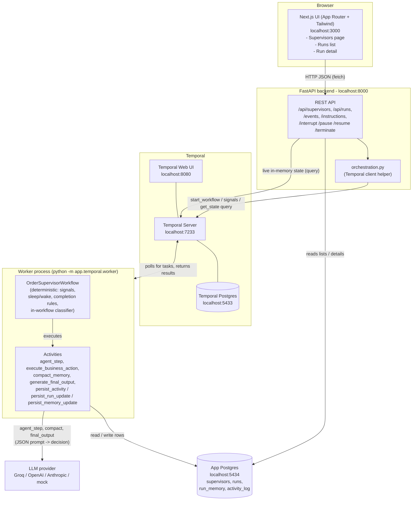
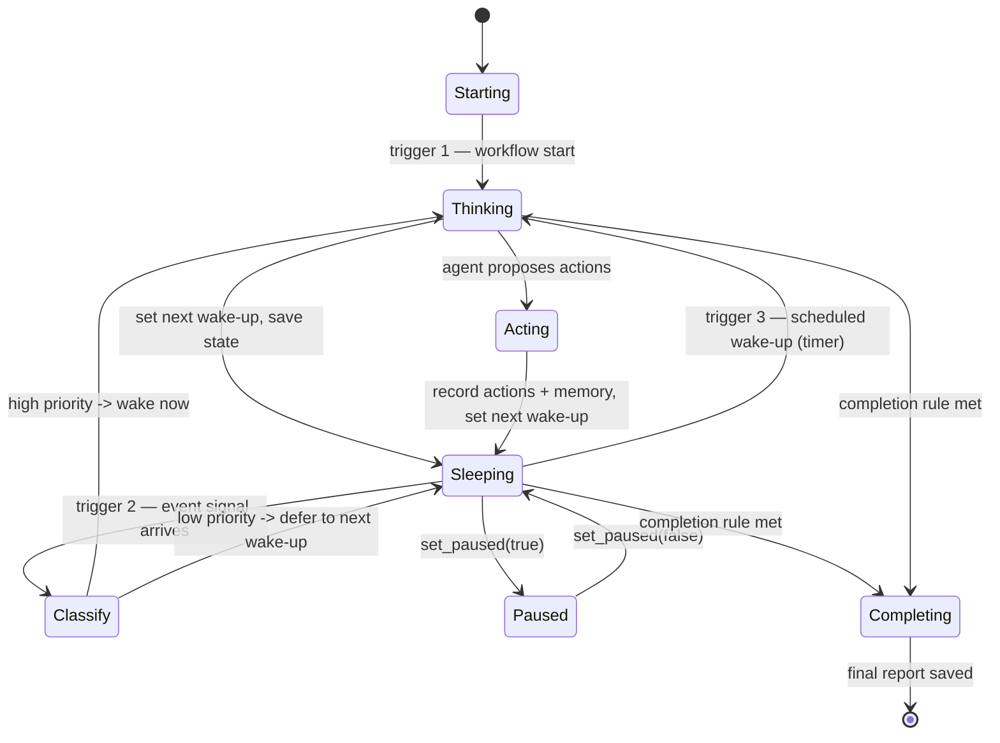
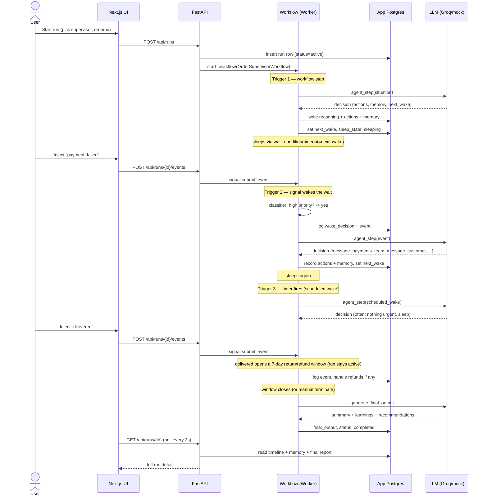
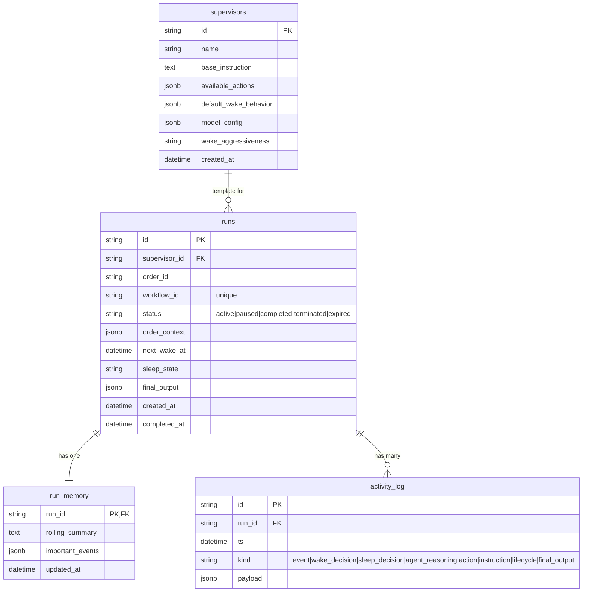

# Architecture Note — Order Supervisor

A long-running AI supervisor that oversees a single e-commerce order from creation
to completion. One **Temporal workflow per order** receives lifecycle events as
**signals**; an LLM agent (running as a Temporal **activity**) decides when to act,
which of 5 business actions to take, and when to sleep/wake. **The workflow owns all
control flow and completion; the LLM only proposes.**

This note is self-contained: it covers the stack, the system diagram, the agent
loop, an end-to-end walkthrough, the lifecycle rules, memory, and the data model.

---

## Tech stack

| Layer | Technology |
|---|---|
| Frontend | Next.js (App Router) + Tailwind CSS |
| Backend | Python + FastAPI |
| Orchestration | Temporal Python SDK (`temporalio`) |
| Database | PostgreSQL (SQLAlchemy async + asyncpg) |
| LLM | Pluggable: Groq / OpenAI / Anthropic / mock (via `httpx`) |
| Infra | Docker Compose (Temporal, Temporal UI, app Postgres, Temporal Postgres) |

## A quick word on Temporal

Temporal is a tool for running long-lived processes reliably. Terms used below:

- A **workflow** is a long-running function that can pause for days and survive
  crashes; Temporal remembers exactly where it was by recording its history.
- An **activity** is a normal function for side effects (LLM, DB, network);
  workflows call activities to touch the outside world.
- A **signal** is a message sent into a running workflow from outside.
- A **query** reads a running workflow's in-memory state without changing it.
- A **durable timer** is a sleep Temporal tracks for you; a workflow can "sleep"
  for hours or days at almost no cost and wake up exactly on time.

We use Temporal because an order lives a long time, is mostly idle, and must not
lose its state if a process restarts — so we get cheap sleeping, reliable
wake-ups, signal delivery, retries, and crash-safety for free.

---

## System architecture (the big picture)

Each box, in plain words:

- **Next.js UI** — the website you click on. It only talks to the FastAPI backend.
- **FastAPI backend** — the web server. It reads the database for lists and details,
  and uses a Temporal client helper to start workflows, send signals, and ask the
  running workflow for its live state.
- **Temporal Server** — the engine that runs long-lived workflows and keeps them
  safe across restarts. It has its own separate Postgres for internal bookkeeping.
- **Worker process** — a separate Python program. This is where the workflow code
  and the activities actually run. Temporal hands it work to do.
- **App Postgres** — our application database. Everything the UI shows lives here.
- **LLM provider** — the AI brain. Only certain activities call it.

> **Determinism rule:** workflow code must be deterministic so Temporal can
> **replay** its history to rebuild state. So the workflow never calls the LLM,
> the DB, the clock, `random`, or the network directly — all of that lives in
> activities. The workflow uses `workflow.now()` for time.

## Key design decisions

1. **Deterministic workflow.** No LLM/DB/`datetime.now()`/`random`/network/env
   inside the workflow. Time via `workflow.now()`; all side effects in activities.
2. **Agent is an activity, not a loop.** `agent_step` does one structured LLM
   inference returning JSON: `{reasoning, actions[], memory_update, important_event,
   next_wake_seconds, wake_guidance, recommend_completion}`. The workflow validates
   it (strict schema, safe fallback), executes the proposed business-action
   activities, persists everything, sets the next wake-up, and sleeps.
3. **Three inference triggers:** workflow start, important signal, scheduled wake-up.
4. **Sleep/wake** via `workflow.wait_condition(..., timeout=next_wake)`. The timeout
   firing with no pending work = the scheduled wake-up (also models
   `no_update_for_n_hours`).
5. **Signals enqueue; the loop drains.** `submit_event`, `add_instruction`,
   `set_paused`, `request_completion`. Queries expose live state.
6. **Lightweight classifier** (deterministic, in-workflow, separate from the agent)
   decides whether an event is important enough to wake the agent now vs. defer.
7. **Persistence is the UI's source of truth.** Activities write timeline, activity
   log, memory, status, and final output. The API reads Postgres + Temporal queries.
8. **`continue_as_new`** when history grows large, carrying compacted memory and
   current order state, so a run can effectively last forever.
9. **Workflow-owned completion.** The agent may *recommend* completion, but a run
   only ends on workflow rules (see "Lifecycle & completion").

---

## The agent's loop: wake, think, act, sleep

The agent runs on exactly **three triggers**, then goes back to sleep:

1. **Workflow start** — the very first run, using the order details and base instruction.
2. **An incoming event (signal)** — but only if the **classifier** rates it important.
   A manual instruction also counts as an interrupt → immediate inference.
3. **A scheduled wake-up** — the sleep timer runs out with nothing pending.

### The wake/sleep classifier

Deterministic, in-workflow (so it stays replay-safe), separate from the agent. For
each event it answers one question: "wake the main AI now, or keep sleeping?"

- Terminal or unknown events → always wake (unknown-event escalation).
- Events the agent flagged via `wake_guidance.wake_on` → wake.
- Otherwise by `wake_aggressiveness`: `aggressive` wakes on everything, `balanced`
  wakes on the high-priority set, `conservative` only on payment/refund failures.
- Low-priority events are logged and the workflow re-sleeps for the *remaining* time
  until its existing wake deadline (the timer is not reset).

Every wake/sleep decision is written to the activity log. This keeps the expensive
LLM calls rare and the cheap rule checks frequent.

---

## An order's journey, end to end

Step by step in plain English:

1. You start a run from the UI. The API creates a run row and starts the workflow.
2. The workflow wakes for the first time (start trigger), asks the AI what to do,
   records the result, sets an alarm, and sleeps.
3. You inject an event (e.g. `payment_failed`). It becomes a signal into the workflow.
4. The classifier checks the event. `payment_failed` is high priority, so it wakes the AI.
5. The AI decides to message the payments team and the customer. The workflow runs
   those actions (each becomes a DB record), updates memory, sets a new alarm, sleeps.
6. Later the alarm fires with nothing pending (scheduled wake). The AI usually decides
   nothing is urgent and sleeps again.
7. You inject `delivered`. The run does not end — it opens a 7-day return/refund window
   and keeps watching (so a late refund is still handled).
8. When the window closes (or you terminate), the AI writes the final report. The run
   is marked `completed` and the UI shows everything.

---

## Lifecycle & completion (workflow-owned)

Completion is decided by `_completion_decision()` in the workflow, never by the agent.
Delivered and undelivered orders follow separate rules so they never clash:

- **Delivered → return/refund window.** `delivered` does NOT end the run. It opens a
  return/refund window (`return_window_hours`, default 7 days). During the window the
  supervisor still handles refunds, customer messages, etc. The run completes
  (`return_window_closed`, status `completed`) when the window closes — or earlier on
  manual termination.
- **Undelivered → expired.** If an order is never delivered and reaches `max_age_hours`,
  the workflow escalates to the fulfillment team, auto-refunds the customer (a
  `message_customer` action + an `auto_refund_initiated` lifecycle entry), records it
  in memory, and ends with status `expired` (reason `expired_undelivered`).
- **Manual termination.** `request_completion` ends gracefully (runs the final report);
  the API also supports a hard `client.terminate` fallback.

A delivered run is governed only by the return window (max age can't kill it); an
undelivered run is governed only by max age.

> **Demo time scaling.** `TIME_SCALE` = real seconds per simulated hour (default `1`).
> So a "6-hour" sleep ≈ 6 seconds, and the default `max_age_hours=720` (30 sim-days)
> means an undelivered run auto-expires in ~12 real minutes — visible on camera.

## Memory & compaction

A rolling summary + a capped list of important events. When the list exceeds a
threshold, `compact_memory` (LLM) folds the older entries into the rolling summary
and keeps the most recent few verbatim — so old detail is summarized, not lost.

---

## Data model (single activity-log approach)

- **supervisors** — reusable templates: name, base instruction, allowed actions,
  default wake behavior, optional model config, and wake aggressiveness.
- **runs** — one row per order: status, order details, next wake time, sleep state,
  and the final report (filled in at the end).
- **run_memory** — the rolling summary and list of important events for a run.
- **activity_log** — one append-only row for everything that happens, tagged with a
  `kind`. This single table is the timeline the UI renders.

---

## Testing

`scripts/test_workflow.py` runs the real workflow against Temporal's time-skipping
test server with the DB mocked in-memory, asserting: start / signal / scheduled-wake
triggers, low-vs-high-priority classification, pause/resume, the delivered →
return-window → close path, and the undelivered → expired (escalate + auto-refund)
path — all with no Docker/Postgres/LLM needed.

## Build phasing (for reference)

- **Phase 0** — scaffold + Hello round trip
- **Phase 1** — DB & persistence layer (single `activity_log`)
- **Phase 2** — Temporal core (signals, drain-loop, wait_condition, queries, workflow-owned completion, continue_as_new hook)
- **Phase 3** — Agent runtime (pluggable LLM, strict decision schema + fallback, classifier, 5 business actions, memory compaction)
- **Phase 4** — FastAPI endpoints
- **Phase 5** — Next.js frontend
- **Phase 6** — LLM end-of-run output, docs, seeded demo script
